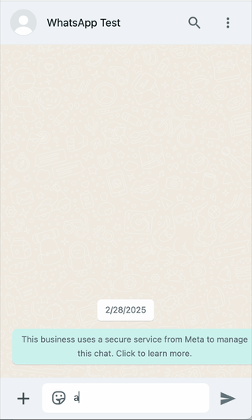
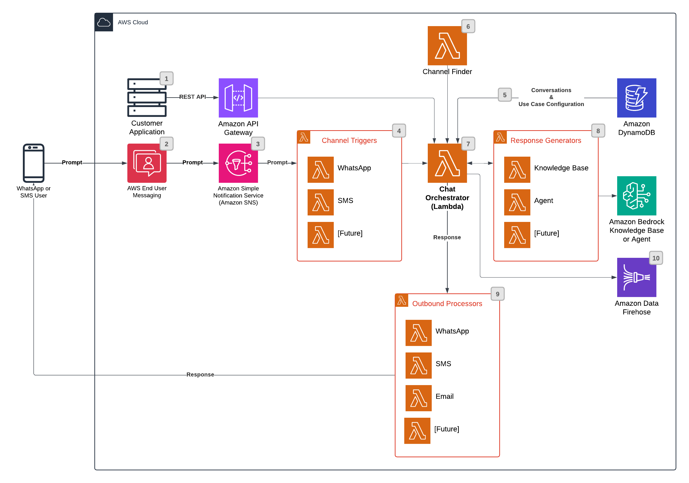

# Chat Orchestrator for Generative AI Conversations

>**BE AWARE:** This code base is an [Open Source](LICENSE) starter project designed to provide a demonstration and a base to start from for specific use cases. 
It should not be considered fully Production-ready. If you plan to deploy and use this in a Production environment, please review the [Using this in Production](#using-this-in-production) section at the end for some additional guidance.

## Use-case scenario

Demonstrates how you can create a communications hub to orchestrate chats between communications channels (AWS End User Messaging 2-way SMS and WhatsApp) and Amazon Bedrock Agents or Knowledge Bases. End users can chat with an Amazon Bedrock Agent to automate multistep tasks that seamlessly integrate with company systems, APIs and data sources. They can engage in dynamic, personalized chats with Amazon Bedrock Knowledge Bases built off documents stored in S3, or crawled from a public facing website.



## Table of Contents

- [Solution components](#solution-components)
- [Solution architecture](#solution-architecture)
- [Solution prerequisites](#solution-prerequisites)
- [Solution setup](#solution-setup)
- [Use Case Configuration](#use-case-configuration)
- [REST API (Optional)](#rest-api-optional)
- [Working with MMS (Images)](#working-with-mms-images)
- [Working with WhatsApp Media (Images)](#working-with-whatsapp-media-images)
- [Conversational Data](#conversational-data)
- [Extending the Solution](#extending-the-solution)
- [Troubleshooting](#troubleshooting)
- [Cleaning up](#cleaning-up)
- [Using this in Production](#using-this-in-production)


## Solution components

On a high-level, the solution consists of the following CDK (CloudFormation) stacks:

* AWS CDK stacks:
    - `cdk-backend-stack` deploys the backend resources needed for the solution (AWS Lambda, SNS Topics, Chat Orchestrator, etc.)
    - `api-stack` deploys an optional REST API so customers can use a common interface to send messages to users across various channels.

## Solution architecture:  



1. Customer Applications can send outbound messages (such as new product promotions, campaigns, shipment notifications, operational delays, etc.) using the optionally deployed REST API. The API specifies the Use Case and can optionally pick the outbound channel (or, leave it to the Channel Finder).
2. User messages are received from AWS End User Messaging.
3. AWS End User Messaging delivers inbound messages to Amazon Simple Notification Services (SNS).
4. Channel Specific Lambda functions are subscribed to their corresponding SNS Topic.  This allows for channel specific pre-processing to be done before sending messages to the Channel Orchestrator.  For example, the WhatsApp SNS topic receives many different events and only some of those maybe user messages.  So the WhatsApp Channel Trigger will filter out any non-user message events. If needed, Customers can add additional Channel Triggers to handle notifications from SQS or other channels such as Email using Amazon Simple Email Services (SES).
5. The Chat Orchestrator retrieves Use Cases and Conversations from an Amazon DynamoDB. The Use Case Configuration indicates:
    - Initial response messages
    - The available channels for the given Use Case
    - The Response Generator to use for that Use Case
6. If a channel isn't specified, a Channel Finder function is called to determine the best channel to send.  The channel selection logic will vary widely by customer and use case, so it is up to the customer to build the necessary selection logic.
7. Based on the retrieved Use Case, the Chat Orchestrator will call the relevant Response Generator and forward the Response to the appropriate Outbound Processor. 
8. Response Generators are responsible for calling the appropriate Amazon Bedrock Agent or Knowledge Base.  Customers can also build Response Generators that call other LLMs if not supported by Bedrock.
9. Once a response is generated, it is forwarded to the appropriate Outbound Processor to send the response back to the user.
10. The solution supports sending conversational data to an Amazon Data Firehose stream if specified during stack configuration.

## Solution prerequisites
* AWS Account
* AWS IAM user with Administrator permissions
* [Amazon Nova Lite Bedrock Model Enabled](https://docs.aws.amazon.com/bedrock/latest/userguide/model-access-modify.html) enabled in your region.  You can also use models by Anthropic.  Please see [Bedrock Models](#using-different-bedrock-models) below for more information
* One (or Both) of the following:
    * Amazon Bedrock Knowledge Base: In order to use the chat processor with a knowledge base you need to have a [Bedrock Knowledge Base](https://docs.aws.amazon.com/bedrock/latest/userguide/knowledge-base-build.html) configured in your account.  
    * Amazon Bedrock Agent: If you want to use the chat processor with an agent instead of a knowledge base, you will need to have a [Bedrock Agent](https://docs.aws.amazon.com/bedrock/latest/userguide/agents.html) created in your region prior to deploying the solution. Sample agents are available in the [Bedrock Agent Samples](https://github.com/aws-samples/amazon-bedrock-samples/tree/main/agents-and-function-calling/bedrock-agents/features-examples/13-create-agent-using-CDK) repository.
* Node (> v18) and NPM (> v8.19) [installed and configured on your computer](https://nodejs.org/en/download/package-manager)
* AWS CLI (v2) [installed and configured on your computer](https://docs.aws.amazon.com/cli/latest/userguide/getting-started-install.html)
* AWS CDK (v2) [installed and configured on your computer](https://docs.aws.amazon.com/cdk/v2/guide/getting_started).
* If configuring SMS: An [ACTIVE SMS Origination Phone Number provisioned](https://docs.aws.amazon.com/sms-voice/latest/userguide/phone-numbers-request.html) in AWS End User Messaging SMS. Note: This must be an Active number that has been registered. Within the US, you can use 10DLC or Toll Free Numbers (TFNs).
* If configuring WhatsApp: An [ACTIVE WhatsApp Origination Phone Number provisioned](https://docs.aws.amazon.com/social-messaging/latest/userguide/getting-started.html) in AWS End User Messaging Social. Note: This must be an Active number that has been registered with Meta/WhatsApp.
* If configuring Outbound Email: An [ACTIVE Email Origination Address provisioned](https://docs.aws.amazon.com/ses/latest/userguide/verify-email-addresses.html) in AWS SES. Note: This must be an Active address that has been verified.

## Solution setup

The below instructions show how to deploy the solution using AWS CDK CLI.
These instructions assume you have completed all the prerequisites.

> Note: If you are using a Windows device please use the [Git BASH](https://gitforwindows.org/#bash) terminal and use alternative commands where highlighted.

1. Clone the solution to your computer (using `git clone`)

2. Check AWS CLI
    - AWS CDK will use AWS CLI local credentials and region. These can be either
      - environment variables (AWS_ACCESS_KEY_ID AWS_SECRET_ACCESS_KEY, AWS_SESSION_TOKEN, AWS_DEFAULT_REGION) set directly in the command line
      - from a [credentials file](https://docs.aws.amazon.com/cli/latest/userguide/cli-configure-files.html), either using the default profile or setting a specific one (i.e. `export AWS_PROFILE=yourProfile`)
    - check your AWS CLI configuration by running any AWS CLI command (e.g. `aws s3 ls`)
    - you can confirm the configured region with  
            `aws ec2 describe-availability-zones --output text --query 'AvailabilityZones[0].[RegionName]'`
    - AWS SDK (used in the configure script in step 4) can use either the environment variables or credentials file/profile config, however note that the region environment variable in this case is AWS_REGION rather than AWS_DEFAULT_REGION (as used in awscli)

3. Install NPM packages
    - Open your Terminal and navigate to `sample-chat-orchestrator-for-generative-ai-conversations/cdk-stacks`
    - Run `npm run install:all`
    - This script goes through all packages of the solution and installs necessary modules (webapp, cdk-stacks, lambdas, lambda-layers)

4. Configure CDK stacks
    - In your terminal,  navigate to `sample-chat-orchestrator-for-generative-ai-conversations/cdk-stacks`
    - Start the configuration script in interactive mode   
      `node configure.js -i`
    - (You can configure it via single command, by directly providing parameters, as described in the script help instructions which you can see by running 
      `node configure.js -h`)
    - When prompted, provide the following parameters:

        - `sms-enabled`: Set to true to enable SMS support
            - `sms-origination-number-id`: The ID of the Origination Phone number you want to use. Can be found in the AWS End User Messaging SMS console by clicking on `Configurations -> Phone numbers` and selecting the phone number you want to use.  The ID is the `Phone number ID` column.  NOTE: This number shouldn't be part of a Phone Pool.
            - `sms-sns-topic-arn`: (Optional) The ARN of the SNS Topic to be used when configuring your SMS Origination Number for 2-way SMS. If not provided, a new SNS Topic will be created and assigned to the SMS Origination Number.
            - `sms-configuration-set`: (Optional) The configuration set to use for the SMS messages.

        - `whatsapp-enabled`: Set to true to enable WhatsApp support
            - `whatsapp-business-account-id`: The ID of the WhatsApp Business Account you want to use. Can be found in the End User Messaging Social Messaging console.
            - `whatsapp-origination-number-id`: The ID of the WhatsApp Origination Phone number you want to use. Can be found in the End User Messaging WhatsApp console.
            - `whatsapp-sns-topic-arn`: (Optional) The ARN of the SNS Topic to be used when configuring your WhatsApp Business Account. If not provided, a new SNS Topic will be created and assigned to the WhatsApp Business Account.

        - `email-enabled`: Set to true to enable OutboundEmail support

        - `use-bedrock-knowledge-base`: Set to true to use Bedrock Knowledge Base for the chatbot
            - `bedrock-knowledge-base-id`: The ID of the Bedrock Knowledge Base you want to use. Can be found in the Bedrock console.

        - `use-bedrock-agent`: Set to true to use Bedrock Agents for the chatbot
            - `bedrock-agent-id`: The ID of the Bedrock Agent you want to use. Can be found in the Bedrock console.
            - `bedrock-agent-alias-id`: The ID of the Bedrock Agent Alias you want to use. Can be found in the Bedrock console.

        - `deploy-api-stack`: Set to true to deploy the API Stack
            - `api-allowed-origins`: The domain of your web application, to allow CORS. For example: https://aaaabbbbcccc.cloudfront.net. Defaults to "*" if not specified.

        - `conversation-firehose-stream`: (Optional) The name of the Firehose Stream to use for storing conversation history. If not specified (defaults to "not-defined"), the conversation history will not be stored permanently.

5. Deploy CDK stacks
    - In your terminal navigate to `[repo name]/cdk-stacks`
    - If you have started with a new environment, please bootstrap CDK: `cdk bootstrap`
    - Run the script: `npm run cdk:deploy`
        - On **Windows devices** use `npm run cdk:deploy:gitbash`
    - This script deploys CDK stacks
    - Wait for all resources to be provisioned before continuing to the next step
    - AWS CDK output will be provided in your Terminal.

6. Configure SNS Filter Policies (OPTIONAL)
    - The WhatsApp SNS topic will receive messages from any phone number that is part of the WhatsApp Business Account.  To save Lambda Execution Costs, you can filter the SNS Topic to only send messages from the WhatsApp Origination Number you selected.
    - You can do this by adding the following filter policy to the SNS Topic:

        ```json
        {
            "context.MetaPhoneNumberIds.arn": ["arn:aws:social-messaging:[Region]:[Account]:phone-number-id/[WhatsApp Origination Number ID]"]
        }
        ```
        - [Region]: The region of the WhatsApp Origination Number
        - [Account]: The account of the WhatsApp Origination Number
        - [WhatsApp Origination Number ID]: The ID of the WhatsApp Origination Number

7. Test the solution

    By default, the solution will configure a use-case for the Knowledge Base and/or Agent if specified in the configure step
    - Using either SMS or WhatsApp, send  `kb` or `agent` to the AWS End User Messaging Phone Number you selected.  You should receive a response from the solution with instructions to proceed with the demo.

## Use Case Configuration
A Use Case describes different messaging scenarios.  By default, the solution will configure a use case for Knowledge Bases and/or Agents.  Each use case will define the channels (SMS and/or WhatsApp) supported by that particular use case. 

The solution uses DynamoDB to store Use Case configurations. The Use Case Configuration table name is exported by the CloudFormation stack and can be found by searching for: `UseCaseTable` in the CloudFormation Outputs Tab.

### Knowledge Bases
Below is the structure for Knowledge Base use cases. For Bedrock Agent configurations, see the Agent Configuration section below.

Knowledge Base Use Case Configuration:
- `useCase` - The identifier "kb" for Knowledge Base use cases
- `channels` - Array of channel configurations:
  - `channel` - The messaging channel ("sms", "whatsapp", or "email")
  - `configurationSet` - (SMS only) The End User Messaging configuration set
  - `enabled` - Whether this channel is enabled for the use case
  - `phoneNumberId` - The End User Messaging phone number ID
  - `processorLambdaName` - The Lambda function that processes messages for this channel

- Knowledge Base Configuration:
  - `knowledgeBaseId` - The ID of the Bedrock Knowledge Base
  - `modelArn` - The ARN of the Bedrock foundation model
  - `guardrailId` - The ID of the Bedrock guardrail to apply
  - `guardrailVersion`: The Guardrail Version to apply. Defaults to 'DRAFT',
  - `modelId`: The LLM model ID.  See [Bedrock Models](#using-different-bedrock-models) below
  - `llmMaxTokens` - Maximum tokens for LLM responses
  - `llmTemperature` - Temperature setting for LLM responses (0-1)
  - `promptTemplate` - The template used to format prompts sent to the Knowledge Base
  - `initialMessage` - The first message sent when a user starts this use case
  - `initialImageId` - If specified, will send the Initial Message along with an Image.  
    - For SMS this needs to be an S3URI of an image to display using MMS.  See [below](#working-with-mms-images) for more information.
    - For WhatsApp this needs to be a WhatsApp Media ID of the image to display.  See [below](#working-with-whatsapp-media-images) to upload images to the Meta Media Server.
  - `responseGeneratorLambdaName` - The Lambda function that generates responses

When a user sends "kb" to start a Knowledge Base conversation, the solution looks up this configuration to determine how to route and process messages through the Knowledge Base.

### Agents
Below is the structure for Bedrock Agent use cases:

Agent Use Case Configuration:
- `useCase` - The identifier "agent" for Bedrock Agent use cases
- `channels` - Array of channel configurations:
  - `channel` - The messaging channel ("sms", "whatsapp", or "email") 
  - `configurationSet` - (SMS only) The End User Messaging configuration set
  - `enabled` - Whether this channel is enabled for the use case
  - `phoneNumberId` - The End User Messaging phone number ID
  - `processorLambdaName` - The Lambda function that processes messages for this channel

- Agent Configuration:
  - `agentId` - The ID of the Bedrock Agent
  - `agentAliasId` - The ID of the Agent Alias to use
  - `initialMessage` - The first message sent when a user starts this use case  
  - `initialImageId` - If specified, will send the Initial Message along with an Image.  
    - For SMS this needs to be an S3URI of an image to display using MMS.  See [below](#working-with-mms-images) for more information.
    - For WhatsApp this needs to be a WhatsApp Media ID of the image to display.  See [below](#working-with-whatsapp-media-images) to upload images to the Meta Media Server.
  - `responseGeneratorLambdaName` - The Lambda function that generates responses

When a user sends "agent" to start an Agent conversation, the solution looks up this configuration to determine how to route and process messages through the Bedrock Agent.

## REST API (Optional)
If you opted to deploy the optional API, the solution will create an API Gateway REST API with a single `sendMessages` method that you can **POST** information to.  

The API accepts a **POST** request with a JSON body containing an array of recipient objects. Each recipient object has the following structure:

- `recipients` - Array of recipient objects:
  - `action` - The action to take 
    - `forward` - Just send the message to the user using the specified channel.
    - `process` - Used by internal SMS and WhatsApp triggers and will send the message to the KB or Agent for processing.
    - `template` - Sends a WhatsApp Template message to the user.  See [below](#working-with-whatsapp-template-messages) for more information.
  - `channel` - The messaging channel ("sms", "whatsapp", or "email")
  - `destinationAddress` - The destination address of the recipient ([E.164 format](https://en.wikipedia.org/wiki/E.164))
    - For SMS and WhatsApp this is the phone number in [E.164 format](https://en.wikipedia.org/wiki/E.164)
    - For Email this is the email address
  - `messageBody` - The text content of the message
  - `subject` - The subject of the email message (Email only)
  - `fromAddress` - The email address to send the message from (Email only)
  - `configurationSet` - (OPTIONAL)The configuration set to use for the email message (Email only)
  - `useCaseId` - The use case identifier ("kb" for Knowledge Base or "agent" for Bedrock Agent)
  - `imageId` - If specified, will send an image along with the message.
    - For SMS this needs to be an S3URI of an image to display using MMS.  See [below](#working-with-mms-images) for more information.
    - For WhatsApp this needs to be a WhatsApp Media ID of the image to display.  See [below](#working-with-whatsapp-media-images) to upload images to the Meta Media Server.

The API has IAM authorization enabled.  The solution will create an IAM user with the necessary IAM permissions to execute the API.  The username is output by the CDK deployment or you can open up the CloudFormation deployment and find `APIIAMUserName` in the Outputs Tab.

You will need to create an [Access Key](https://docs.aws.amazon.com/IAM/latest/UserGuide/id_credentials_access-keys.html) for this user to make REST API calls

**Important**: IAM users with access keys are an account security risk. Manage your access keys securely. Do not provide your access keys to unauthorized parties, even to help find your account identifiers. By doing this, you might give someone permanent access to your account.

    When working with access keys, be aware of the following:
    - Do NOT use your account's root credentials to create access keys.
    - Do NOT put access keys or credential information in your application files.
    - Do NOT include files that contain access keys or credential information in your project area.
    - Access keys or credential information stored in the shared AWS credentials file are stored in plaintext.

### Testing the API

You can use `CURL` to test the REST API:

### Sending Messages

#### Email
```bash
curl "[API REST Endpoint]/sendMessages" \
--request POST \
--aws-sigv4 "aws:amz:us-east-1:execute-api" \
--user "[Access Key]":"[Access Key Secret]" \
--data '{"recipients":[{"action":"forward", "channel":"email","destinationAddress":"[Destination Address (Email format)]","fromAddress":"[From Address (Email format)]","subject":"This is a test message?","messageBody":"This is a test message Body?","useCaseId": "api"}]}' \
--header 'Content-Type: application/json'
```

- [API REST Endpoint]: This is output by the CDK deployment or you can open up the CloudFormation deployment and find the `APIEndpointURL` in the Outputs Tab.
- [Access Key] & [Access Key Secret]: Created when you enable an Access Key for the user created by the solution. The username is output by the CDK deployment or you can open up the CloudFormation deployment and find `APIIAMUserName` in the Outputs Tab.
- [Destination Address]: The destination email address
- [From Address]: The email address to send the message from.  Must be an active email identity in SES.

#### SMS
```bash
curl "[API REST Endpoint]/sendMessages" \
--request POST \
--aws-sigv4 "aws:amz:us-east-1:execute-api" \
--user "[Access Key]":"[Access Key Secret]" \
--data '{"recipients":[{"action":"forward", "channel":"sms","originationNumber": "[Destination Address (E.164 format)]","messageBody":"This is a test message?", "useCaseId": "api"}]}' \
--header 'Content-Type: application/json'
```

- [API REST Endpoint]: This is output by the CDK deployment or you can open up the CloudFormation deployment and find the `APIEndpointURL` in the Outputs Tab.
- [Access Key] & [Access Key Secret]: Created when you enable an Access Key for the user created by the solution. The username is output by the CDK deployment or you can open up the CloudFormation deployment and find `APIIAMUserName` in the Outputs Tab.
- [Destination Address]: The destination phone number in [E.164 format](https://en.wikipedia.org/wiki/E.164)

#### WhatsApp Template Messages
You can use message templates for message types that you use frequently, such as weekly newsletters or appointment reminders. Template messages are the only type of message that can be sent to customers who have yet to message you, or who have not sent you a message in the last 24 hours.

> Important: Starting on 4/1/2025 Meta will block marketing message templates sent to the US country code of +1. For more information, see [Per-User Marketing Template Message Limits](https://developers.facebook.com/docs/whatsapp/cloud-api/guides/send-message-templates#per-user-marketing-template-message-limits) in the WhatsApp Business Platform Cloud API Reference.

- Create a `messages.json` file with the following content
```json
{
    "recipients": [
        {
            "action": "template",
            "channel": "whatsapp",
            "destinationAddress": "[Destination Address (E.164 format)]",
            "messageBody": {
                "name": "[Template Name]",
                "language": {
                    "code": "en"
                },
                "components": [
                    {
                        "type": "body",
                        "parameters": [
                            {
                                "text": "[Users First Name]",
                                "type": "text"
                            }
                        ]
                    }
                ]
            },
            "useCaseId": "api"
        }
    ]
}
```

> NOTE: the `messageBody` object is just passed through to Meta.  Please refer to [Template Messages](https://developers.facebook.com/docs/whatsapp/cloud-api/guides/send-message-templates) to see the format of this object.

- Execute following CURL command
```bash
curl "[API REST Endpoint]/sendMessages" \
--request POST \
--aws-sigv4 "aws:amz:us-east-1:execute-api" \
--user "[Access Key]":"[Access Key Secret]" \
--data @messages.json \
--header 'Content-Type: application/json'
```

### API Throttling
To prevent your API from being overwhelmed by too many requests, the solution configures (relatively low) throttling limits of **10** per second with a burst of **10**.  You will want to [adjust these limits for your particular use-case](https://docs.aws.amazon.com/apigateway/latest/developerguide/http-api-throttling.html)

## Working with MMS (Images)
MMS is a feature of AWS End User Messaging that allows you to send images to your customers.  To use MMS, you need to note the [requirements here](https://docs.aws.amazon.com/sms-voice/latest/userguide/send-mms-message.html#send-mms-message-prerequisite) and upload the image to an S3 bucket and then use the S3URI as the imageId in the API call.  The S3URI should be in the format of `s3://[bucket-name]/[key]`.

> NOTE: The Lambda function that processes the MMS message will need to have access to the S3 bucket. You can search the Lambda console for `smsProcessorLambda` to find the Lambda function.  You can do this by adding the following policy to the Lambda function:

```json
{
    "Effect": "Allow",
    "Action": "s3:GetObject",
    "Resource": "arn:aws:s3:::[bucket-name]/*"
}
```

## Working with WhatsApp Media (Images)
WhatsApp requires Images to be [uploaded to the Meta Media Server](https://docs.aws.amazon.com/social-messaging/latest/userguide/managing-media-files-s3.html) for use in WhatsApp messages.  See the following for how to upload an image and obtain the MediaID:

```bash
aws socialmessaging post-whatsapp-message-media \
--origination-phone-number-id phone-number-id-05417fb536264b3cbc4XXXXXXX \
--source-s3-file "bucketName=[BucketName],key=mms/amazonlogo.png"
```


## Conversational Data
This solution will store conversational data in Amazon DynamoDB. Using [DynamoDB TTL](https://docs.aws.amazon.com/amazondynamodb/latest/developerguide/TTL.html), this data is automatically removed after 10 minutes.  This can be configured by changing the `SESSION_SECONDS` variable in the `cdk-stacks/lib/cdk-backend-stack.ts` file.

The `ChatContext` table has the following structure:
- `phoneNumber` (Partition Key) - Incoming phone number
- `messageId` (Sort Key) - The messageId generated by AWS End User Messaging
- `channel` - The channel the message was sent from (text or WhatsApp)
- `direction` - The direction of the message (inbound or outbound)
- `knowledgeBaseId` - The ID of the Bedrock Knowledge Base used in the conversation
- `message` - The message sent by the end user or the response from the Bedrock Knowledge Base
- `serviceAddress` - The ID of the Origination Phone number used in the conversation
- `previousPublishedMessageId` - The ID of the previous published message in the conversation. Note this only applies to SMS
- `sessionId` - The Bedrock Knowledge Base Session ID
- `source` - Indicates if the question was answered by a Bedrock Agent, the Bedrock Knowledge Base, or the General LLM
- `timestamp` - The timestamp of the message.  Note: there is a secondary index on phoneNumber and timestamp so that you can query the table for messages sent by a particular phone number and have the conversation ordered chronologically.
- `ttl` - The [DynamoDB TTL](https://docs.aws.amazon.com/amazondynamodb/latest/developerguide/TTL.html) for the message.  This is used to automatically remove the conversation after the conversation has ended.

> NOTE: If you need to use this data for other purposes such as AI/ML training or other analytics, you can deploy the following starter project: [Engagement Database and Analytics Sample For End User Messaging and SES](https://github.com/aws-samples/Engagement-Database-And-Analytics-Sample-For-End-User-Messaging-And-SES) which will deploy an Amazon Data Firehose data stream.  Once that project is deployed you can enable the optional `conversation-firehose-stream` parameter when configuring the solution.  This will send the conversation history to the Amazon Data Firehose Stream.  

The [Engagement Database and Analytics Sample For End User Messaging and SES](https://github.com/aws-samples/Engagement-Database-And-Analytics-Sample-For-End-User-Messaging-And-SES) solution isn't a requirement, but it is a good starting point for using this data for other purposes such as AI/ML training or other analytics. If you don't want to use that sample, you can then configure other destinations for the Firehose Stream such as Amazon S3, Amazon Redshift, or Amazon OpenSearch.

You can also use [DynamoDB Streams](https://docs.aws.amazon.com/amazondynamodb/latest/developerguide/time-to-live-ttl-streams.html) to persist the data in another service.

## Using different Bedrock Models
You can experiment with different models by updating the `modelId` value in the Configuration DynamoDB table.  The table name is exported by the CloudFormation stack and can be found by searching for: `UseCaseTable` in the CloudFormation Outputs Tab.

The solution has been tested with the following Bedrock Models:

- `amazon.nova-micro-v1:0` (Default)
- `amazon.nova-lite-v1:0`
- `us.anthropic.claude-3-5-sonnet-20241022-v2:0` (See `Cross-region inference` in the Bedrock Console for the IDs to use in your region)
- `us.anthropic.claude-3-5-haiku-20241022-v1:0` (See `Cross-region inference` in the Bedrock Console for the IDs to use in your region)

> Note: This configuration only applies to Bedrock Knowledge Base configurations.  Bedrock Agent Models are configured in the Agent Console. 

> Note: You may need to adjust the [promptTemplate](#knowledge-bases) or other parameters to optimize for the models specific capabilities and response format, as it might handle prompts differently.

## Extending the Solution

### Custom Channels
By default, this solution supports SMS, WhatsApp, and Email(outbound only).  You can extend the solution to support other channels by adding the following:
- Creating a new "Channel Trigger" Lambda function that will be triggered by the new channel.  See the existing [SMS Channel Trigger](./cdk-stacks/lib/lambdas/handlers/node/triggers/smsTrigger.mjs) Lambda function for an example.
- Creating a new "Outbound Processor" Lambda function that will be used to send outbound messages to end users.  See the existing [SMS Outbound Processor](./cdk-stacks/lib/lambdas/handlers/node/outbound-processors/smsProcessor.mjs) Lambda function for an example.
- Updating the [Use Case](#use-case-configuration) to support the new channel.

### Custom Response Generators
By default, this solution uses the Bedrock Knowledge Base and Bedrock Agent to generate responses.  You can extend the solution to use a different LLM by adding the following:
- Creating a new "Response Generator" Lambda function that will be used to generate responses.  See the existing [Knowledge Base](./cdk-stacks/lib/lambdas/handlers/node/response-generators/kbResponseGenerator.mjs) for an example.
- Updating the [Use Case](#use-case-configuration) to use the new response generator.

## Troubleshooting
- If you don't receive a response from the AWS End User Messaging Phone Number you selected, please check the following:
    - Verify the Knowledge Base and Agent specified are configured and are providing responses in the AWS Console.
    - Ensure that the phone number you selected is a SMS or WhatsApp enabled End User Messaging number
    - Inspect the CloudWatch Logs for the `ChatOrchestrator` Lambda function to ensure it is processing messages correctly
        - For more detailed logs you can [Set the Log Level to TRACE](https://docs.aws.amazon.com/lambda/latest/dg/monitoring-cloudwatchlogs-advanced.html#monitoring-cloudwatchlogs-log-level-setting)
- Credential Errors:
```
@aws-sdk/credential-provider-node - defaultProvider::fromEnv WARNING:
    Multiple credential sources detected:
    Both AWS_PROFILE and the pair AWS_ACCESS_KEY_ID/AWS_SECRET_ACCESS_KEY static credentials are set.
    This SDK will proceed with the AWS_PROFILE value.

    However, a future version may change this behavior to prefer the ENV static credentials.
    Please ensure that your environment only sets either the AWS_PROFILE or the
    AWS_ACCESS_KEY_ID/AWS_SECRET_ACCESS_KEY pair.
```
Remove either the AWS_PROFILE or the credentials from your environment.

- Credential Errors:
```
@aws-sdk/credential-provider-node - defaultProvider::fromEnv WARNING:
    Multiple credential sources detected:
    Both AWS_PROFILE and the pair AWS_ACCESS_KEY_ID/AWS_SECRET_ACCESS_KEY static credentials are set.
    This SDK will proceed with the AWS_PROFILE value.

    However, a future version may change this behavior to prefer the ENV static credentials.
    Please ensure that your environment only sets either the AWS_PROFILE or the
    AWS_ACCESS_KEY_ID/AWS_SECRET_ACCESS_KEY pair.
```
Remove either the AWS_PROFILE or the credentials from your environment.

## Cleaning up

To remove the solution from your account, please follow these steps:

1. Remove CDK Stacks
    - Run `cdk destroy --all`

2. Remove deployment parameters from AWS System Manager Parameter Store
    - Run `node configure.js -d`


## Using this in Production

It is critical that before you use any of this code in Production that you work with your own internal Security and Governance teams to get the appropriate Code and AppSec reviews for your organization. 

Although the code has been written with best practices in mind, your own company may require different ones, or have additional rules and restrictions.

You take full ownership and responsibility for the code running in your environment, and are free to make whatever changes you need to.

> Note: - This solution deploys a basic set of [Bedrock Guardrails](https://aws.amazon.com/bedrock/guardrails/) The current guardrails will check for abuse, profanity, and prompt injection attacks.  You may have more or less guardrail requirements.  If so, please adjust the Guardrail accordingly.  The guardrail is only deployed to the Knowledge Base.  If you configure the solution to use Agents, you can update your agent accordingly to use the defined guardrail.

**Some of the things you will want to consider**
- The starter project creates an S3 bucket to store the documents used for the Bedrock Knowledge Base.  You may want to use [Amazon Macie](https://docs.aws.amazon.com/macie/latest/user/what-is-macie.html) to assist in discovery of potentially sensitive data in S3 buckets.  Amazon Macie can assist in discovery of potentially sensitive data in S3 buckets, and can be enabled on a free trial for 30 days, up to 150GB per account.
- Consider enabling model invocation logging and set alerts to ensure adherence to any responsible AI policies. - Model invocation logging is disabled by default. See https://docs.aws.amazon.com/bedrock/latest/userguide/model-invocation-logging.html
- The starter project has extensive logging to CloudWatch, but does not have any monitoring or tracing included, you may want to look at using tools like CloudWatch Alarms and X-ray.
- The starter project tags all resources with the tags listed in `cdk-stacks/config.params.json` and anything created through the dashboard has the tags in `cdk-stacks/lambdas/constants/Tags.js` added. You may wish to replace them with your own company requirements, or tag at a more granular level.
